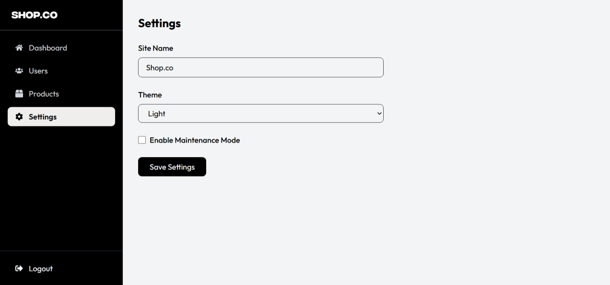
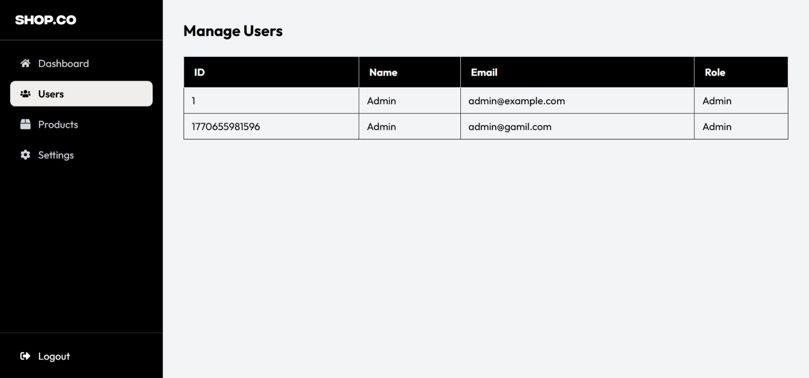

 #  E‑Commerce MERN Frontend Project

## Overview
This project is a **React + Tailwind CSS frontend** for an e‑commerce platform. It simulates a shopping experience with product listings, cart functionality, user authentication, and an admin dashboard.

## Features
- **Home Page**: Hero banner, brand trust logos, new arrivals, and best sellers.
- **Products Page**: Displays all products with reusable `ProductCard` component.
- **Product Details Page**: Shows product info, sizes, add‑to‑cart button, and related products.
- **Cart Page**: Lists items, allows removal, and calculates total.
- **Login/Signup Page**: Handles user and admin login.  
  - Normal user → Home page  
  - Admin → Admin Dashboard
- **Admin Dashboard**:
  - Sidebar navigation
  - Dashboard overview with stats
  - Manage Products (add, update, delete)
  - Manage Users (list users, roles)
  - Settings (site name, theme, maintenance mode)

## Tech Stack
- **Frontend**: React.js, Tailwind CSS
- **Routing**: React Router DOM
- **State Management**: Context API
- **Icons**: React Icons
- **Data**: Static arrays (products, users) simulating backend

## Project Structure

```
src/ ├── assets/     # Images, assets.js Product data
├── components/      # Navbar, Footer, ProductCard, ProductSection, AdminSidebar,BestsellerProducts,BrandTrust,NewArrivalProducts,Hero
├── context/         # CartContext, UserContext
├── pages/           # Home, Products, ProductDetails, Cart, Login
├── admin/           # AdminDashboard, AdminHome, AdminProducts, AdminUsers, AdminSettings
└── App.jsx          # Routes setup

```

## How to Run
1. Clone the repository.
2. Install dependencies:
   
```
npm install
```
3.  Start the development server:
4.  Open ``` http://localhost:5173 ``` in your browser.

## Preview

<p align="center" style="display:flex; ; align-items:flex-start;">
  
  
  
</p>

<p align="center" justify="start">
  
   
   

</p>

<p>
    
    
     
    
</p>


   
